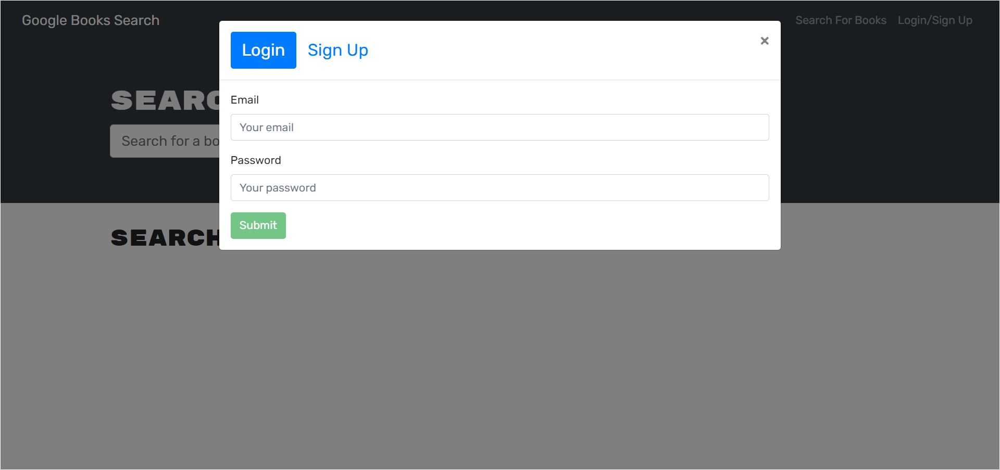
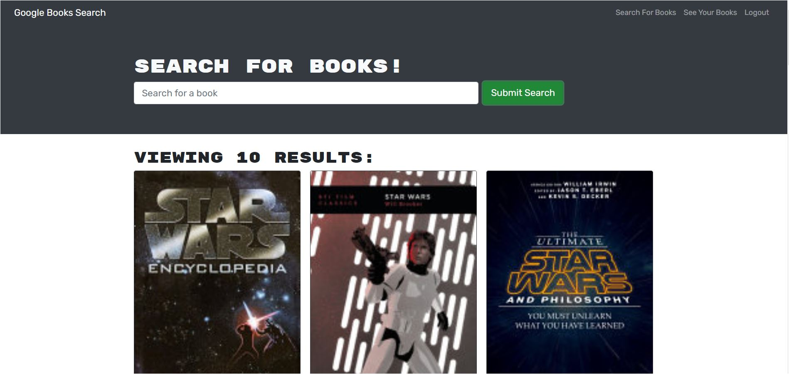
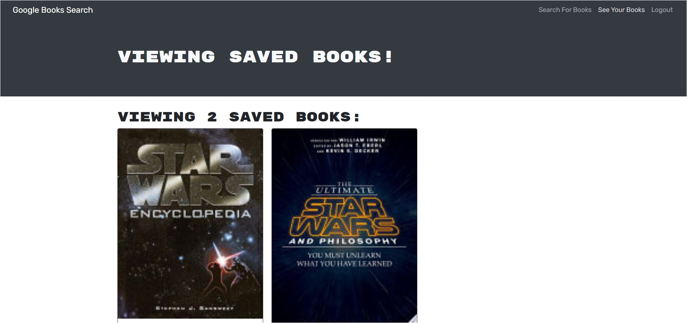

# Book Search Engine

## Description

This Google Books search engine is built with MERN stack. Users can signup and login, search for books, and save their favorite books to their accounts.

## Table of Contents

* [Live Application](#LiveApplication)  
* [Screenshots](#Screenshots)  
* [Installation](#Installation)  
* [Usage](#Usage)   
* [License](#License)  
* [Tests](#Tests)  
* [Questions](#Questions)

## Live Application

[Link of the Deployed App](https://)

## Screeshots

Login/Signup

Searched Books

Saved Books

## Installation 

1. Clone the [repository](https://github.com/Garethus/book-search-engine) of this project from Github into your local machine. 
2. Navigate to the project's directory. 
3. Open integrated terminal in personal IDE.
4. Then, run `npm install` in the highest level of root directory to install all the dependencies. 

## Usage

1. Open integrated terminal in personal IDE.
2. Then, run `npm run develop` to start a local development server and to compile required static assets.

## License

Licensed under the [MIT](./LICENSE) license.

## Contributing

If you want to help me make this application better, clone the repo, commit your changes and create a pull request. Thanks!

## Tests

No test for this application.

## Questions
    
If you have any questions about the project please contact me through my [GitHub](https://github.com/Garethus) or email me at reyes.grethelmaec@gmail.com.

